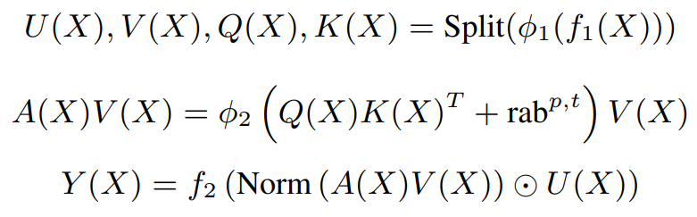
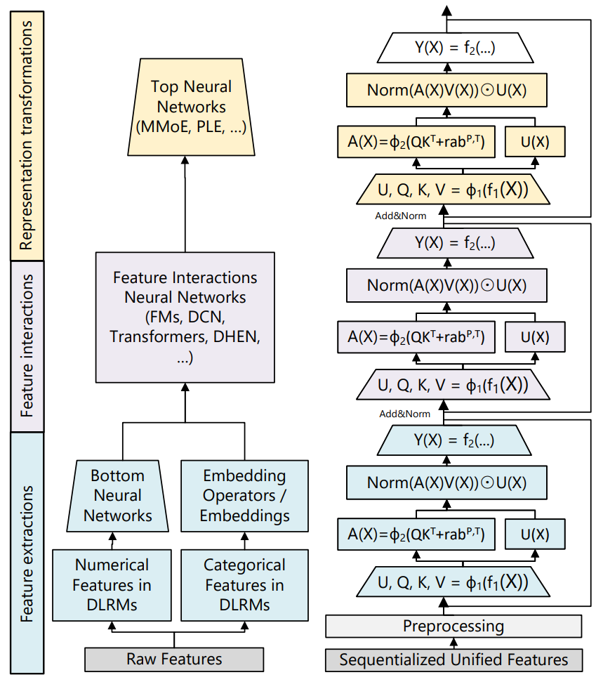

# Toy-RecLM

①A toy large model for recommender system based on [LLaMA2](https://arxiv.org/pdf/2307.09288.pdf), [SASRec](https://cseweb.ucsd.edu/~jmcauley/pdfs/icdm18.pdf), and Meta's [generative recommenders](https://arxiv.org/pdf/2402.17152.pdf). ②Note and experiments of [official implementation](https://github.com/facebookresearch/generative-recommenders) for Meta's generative recommenders.

## Part 1. DIY Toy RecLM

Toy RecLM includes DIY model based on LLaMA2(HSTU) + SASRec prediction layer.  

### 1.1. Training Framework

+ [DDP](https://pytorch.org/tutorials/intermediate/ddp_tutorial.html)

### 1.2. Model Architecture

+ Version 1: Basic Implementation -- Combination of LLaMA2 and SASRec.

    LLaMA2 model as backbone based on [baby-llama2-chinese](https://github.com/DLLXW/baby-llama2-chinese) and [SASRec](https://cseweb.ucsd.edu/~jmcauley/pdfs/icdm18.pdf)([SASRec.pytorch](https://github.com/pmixer/SASRec.pytorch/tree/master)) at the prediction part. 

    + Part 1: At first, we stack LLaMA2's Transformer Blocks. Note that since LLaMA2 uses decoder-only framework, it utilizes casual mask just the same as SASRec. 

    <div  align="center">    
        
        <p>LLaMA2 Transformer Block</p>
        <!-- 
        <p>LLaMA2 Transformer Block</p> -->
    </div>

    + Part 2.1: After Transformer Blocks, we implement prediction layer in SASRec. Specifically, we adopt an MF layer to predict the relevance of item $i$ by sharing item embedding.

    <!-- <div  align="center">    
        
        <p>MF Layer using Shared Item Embedding</p>
    </div> -->
     
    + Part 2.2: we generate an embedding by considering all actions of a user following SASrec.

    <!-- <div  align="center">    
        
        <p>Explicit User Modeling by Generating Embedding</p>
    </div> -->

+ Version 2. **[actions-speak-louder-than-words](https://arxiv.org/pdf/2402.17152.pdf)'s modification for Model** -- Hierarchical Sequential Transduction Unit (HSTU)

    ***Note that HSTU adopts a new pointwise aggregated attention mechanism instead of softmax attention in Transformers. (Just as in [Deep Interest Network](https://github.com/zhougr1993/DeepInterestNetwork)).***

    + HSTU
        
        <div  align="center">    
            
            
            <!-- 
             -->
            <p>HSTU formulae & Structure</p>
        </div>
    
### 1.3. Model Training

We convert each user sequence (excluding the last action) 
$$
(\mathcal{S}_{1}^{u},\mathcal{S}_{2}^{u},\cdots,\mathcal{S}_{|\mathcal{S}^{u}|-1}^{u})
$$ 
to a fixed length sequence $s = \{s_1, s_2, . . . , s_n\}$ via truncation or padding items. We define $o_t$ as the expected output at time step $t$ and  adopt the binary cross entropy loss as the objective function as in SASRec.

<!-- <div  align="center">    
    
    <br>
    
    <p>Model Training following SASRec</p>
</div> -->

### 1.4. Implementation for **Matching Task**

**[actions-speak-louder-than-words](https://arxiv.org/pdf/2402.17152.pdf)'s design for Matching** 

#### 1.4.1. Data Process

Input is dataset of samples of ***user historical behavior sequences*** as follows.

```
<user_1 profile> <item_1 id features> ... <item_n id features>
<user_2 profile> <item_1 id features> ... <item_n id features>
```

Moreover, ***auxiliary time series tokens*** could be added into seqs above if available.

#### 1.4.2. Installation

use the command to setup environment
```bash
# add conda-forge
conda config --add channels conda-forge

# install env
conda env create -f env.yml -n reclm
conda activate reclm
```

#### 1.4.3. Training

Predict $p(\hat{s}_{i+1}|s_1,\cdots,s_i )$, and ***non-behavioral tokens & negative feedback*** will not included in loss calculation.

To train this model, use the command (set mode by *\$eval_only\$* and choose backbone by *\$model_name\$*)
```bash
# LLaMA2 as backbone
torchrun --standalone --nproc_per_node=2 main.py --eval_only=false --model_name='llama'

# HSTU as backbone
torchrun --standalone --nproc_per_node=2 main.py --eval_only=false --model_name='hstu'
```

#### 1.4.4. Evaluation

Use **NDCG\@10** and **HR\@10** to evaluate performance on whole dataset.

To evalutate this model by NDCG and hit ratio, use the command (set mode by *\$eval_only\$* and load checkpoint by *\$ckpt_name\$*,  and choose backbone by *\$model_name\$*)
```bash
# LLaMA2 as backbone
torchrun --standalone --nproc_per_node=2 main.py --eval_only=true --ckpt_name='epoch_15.pth' --model_name='llama'

# HSTU as backbone
torchrun --standalone --nproc_per_node=2 main.py --eval_only=true --ckpt_name='epoch_15.pth' --model_name='hstu'
```

About evaluation function, please refer to https://pmixer.github.io/posts/Argsort.

Dataset: 

+ [Movielens1M_m1](https://huggingface.co/datasets/reczoo/Movielens1M_m1)

### 1.5. Training Support

#### 1.5.1. Support Acceleration by DeepSpeed 

To accelerate by [DeepSpeed](https://github.com/microsoft/DeepSpeed), use the command
```bash
# pip install deepspeed

# recommended local compilation
git clone https://github.com/microsoft/DeepSpeed/
cd DeepSpeed
rm -rf build
TORCH_CUDA_ARCH_LIST="8.6" DS_BUILD_CPU_ADAM=1 DS_BUILD_UTILS=1 pip install . \
--global-option="build_ext" --global-option="-j8" --no-cache -v \
--disable-pip-version-check 2>&1 | tee build.log
```

##### Multi-node Configuration: Setup Passwordless SSH

For resource configuration of multi-node, we need generate ssh-key by ***ssh-keygen*** and pass key to other nodes by ***ssh-copy-id***. Here we have one node with 2 gpus(NVIDIA RTX A6000). Still, we set multi-node configuration for guidance and in this case host just need to communicate with itself.

+ First generate ssh-key

```bash
ssh-keygen
```

+ Write ~/.ssh/config to get nickname and identity file of host and as follows.

```bash
Host host1
    User guyr
        Hostname 127.0.0.1
            port 22
                IdentityFile ~/.ssh/id_rsa
```

+ Write hostfile for deepspeed to get multi-node.

```bash
host1 slots=2
```

+ Use ***ssh-copy-id*** to copy identity file to other nodes

```bash
ssh-copy-id -i ~/.ssh/id_rsa host1

# test
ssh host1
```

##### Argument Parser Configuration

To successfully run deepspeed, we need to add ***local_rank*** & ***deepspeed*** parameters in argparser, since deepspeed will add these hyperparameters to each process when launching tasks.

```python
# when use deepspeed
parser.add_argument("--local_rank", type=int, default=0)
parser.add_argument("--deepspeed", type=str, default="ds_config.json")
```

Finally run deepspeed using the command

```bash
deepspeed --hostfile ./hostfile --master_port 12345 --include="host1:0,1" main.py --eval_only=false --model_name='llama' --deepspeed ds_config.json
```

#### 1.5.2. Support Setuptools & Docker

##### Setuptools

Add ***setup.py*** to set package configuration and required packages.

##### Docker

+ Install [Ubuntu docker](https://www.runoob.com/docker/ubuntu-docker-install.html), test installation using the command
```bash
docker run hello-world
```

+ Add Dockerfile

Add Dockerfile to build docker env. Specifically, we use the command ***\$ pip install -e .[deepspeed]*** to build env by ***setup.py*** in path './' and make this package editable. Use the command
```bash
# build docker
docker build -t toyreclm .
```

+ Add gpu configuration to docker

Use the command to add nvidia-container-script
```bash
sudo sh nvidia-container-runtime-script.sh
sudo apt-get install nvidia-container-runtime
sudo apt-get install -y nvidia-container-toolkit
sudo systemctl restart docker

# check
which nvidia-container-runtime # /usr/bin/nvidia-container-runtime
```

+ Run docker

Use the command to run docker container
```bash
# run docker with container name $reclm$ and volume corresponding folders
docker run -it --gpus all --name reclm -e CONTAINER_NAME=reclm -v ./data:/app/data toyreclm /bin/bash
# # to copy data files into container
# docker cp ./data $CONTAINER_NAME:/app/

# check container name
echo $CONTAINER_NAME

# run ddp
torchrun --standalone --nproc_per_node=2 main.py --eval_only=false --model_name='llama'
```

**WHY NOT DEEPSPEED?**

Install SSH is not recommended in docker since it conflicts with the concept of docker that each container runs only one process.

### 1.6. News

+ [2024.4.4]: Support [Deepspeed](https://www.deepspeed.ai/getting-started/).

+ [2024.4.7]: Support [setuptools](https://pypi.org/project/setuptools/) and [Docker](https://www.docker.com/).


## Part 2. Note and Experiments for Official Implementation

Facebookresearch updates [official implementation of generative recommenders](https://github.com/facebookresearch/generative-recommenders), here to analyze and carry out additional experiments for better comprehension. **This part is placed at the folder './analysis'**.

```
├─analysis
  ├──note
  │  ├───details.md
  │  ├───neural-retrieval-accelerator.md
  │  └───adaptation4rec.md
  ├──exp
  └──src
```

### 2.1 Note

In [details.md](./analysis/note/details.md), we discuss the details of the generative-recommender, e.g., 
+ data preprocess
+ training process
+ model architecture

Notably, this work inherits many ideas from [Revisiting Neural Retrieval on Accelerators](https://arxiv.org/abs/2306.04039), and these work are from same authors. 

So, in [neural-retrieval-accelerator.md](./analysis/note/neural-retrieval-accelerator.md), we discuss the details of this related work.