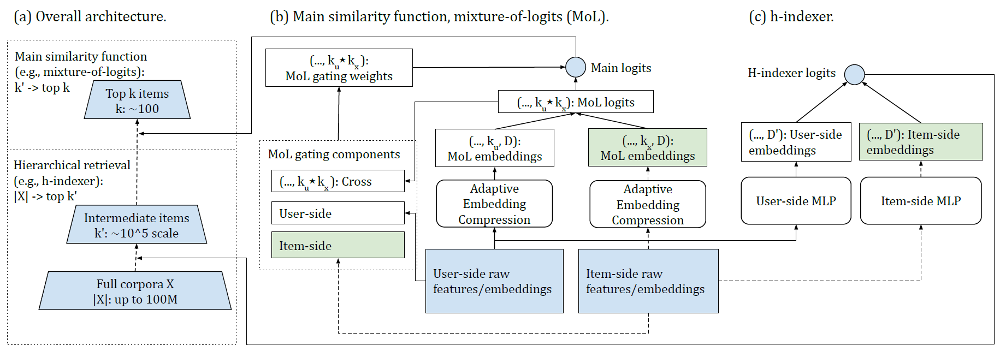
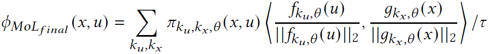
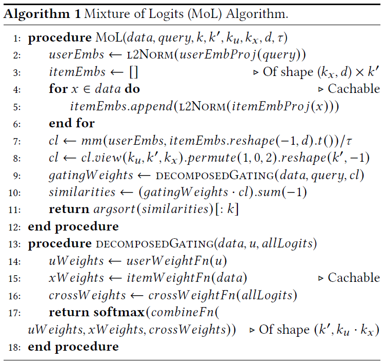

# Note of Revisiting Neural Retrieval on Accelerators

It examines non-dot-product retrieval settings on accelerators, and
proposes ***mixture of logits (MoL)***, which models (user, item) similarity
as an adaptive composition of elementary similarity functions.

Besides, a hierarchical retrieval strategy, ***h-indexer***, to scale up MoL.

## non-dot-product retrieval method

    
    
    
retrieval method illustration. green parts can be cached.

### Main similarity function: mixture of logits (MoL)

+ dot product 👉 low-rank similarities

+ MoL 👉 one specific class of high-rank similarities

Similarity function between user $u$ and item $x$ is $\phi_{\theta}(u,x)$. The basic idea in MoL is to ***parameterize $\phi_{\theta}(u,x)$ as an adaptive mixture of more elementary logits***,

$$
\phi_{MoL}(u,x) = \sum_{k}{\pi_{k,\theta}(u,x) \delta_{k,\theta}(u,x)},
$$

where $\pi_{k,\theta}(u,x)$ are adaptive gating weights and $\delta_{k,\theta}(u,x)$ are elementary logits.

#### How MoL achieves high rank interaction?

In brief, $\delta_{k,\theta}(u,x)$ can be parameterized by any form of neural networks, achieving arbitrarily high rank.

For instance, using $k$ groups of dot products (of potentially different embedding dimensions), 

$$
\phi_{MoL_{dot products}}(u,x) = \sum_{k}{\pi_{k,\theta}(u,x) <f_{k,\theta}(u), g_{k,\theta}(x)>},
$$

#### Embedding Sharing and Adaptive Embedding Compression

Adaptive Logits Selection: The Cartesian product of user-side and item-side embs is expensive. So, 

+ user-side / context-side: 

transform the $k'_u$ embs $v'_i$'s into $k_u$ embs $v_i$'s of the same dimension.

+ item-side: 

generate some item-side embeddings on the fly with learned MLP.

#### Gating Function Decomposition

$\pi_{k,\theta}(u,x)$ decomposes to DNNs that respectively:

+ takes item-side feature
+ takes user-side feature
+ takes cross feature

as inputs.

#### L2 normalization

L2 normalization forces all MoL component embs in Equation 6 to lay on the surface of a $d$-dimensional hypersphere.

    
    
    
L2 norm of user & item embs

#### Pseudocode

    
    
    
Pseudo code of MoL

